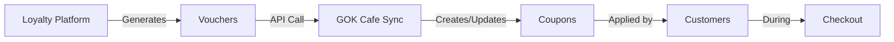

# Quick Start: Loyalty Platform Integration

## 🚀 Quick Setup (5 Minutes)

### 1. Configure Loyalty Platform URL
Edit `GOKCafe.API/appsettings.Development.json`:
```json
{
  "LoyaltyPlatform": {
    "Url": "http://localhost:8079",
    "ApiKey": ""
  }
}
```

### 2. Build and Run
```bash
cd GOKCafe.API
dotnet build
dotnet run
```

### 3. Get Admin Token
Login as admin to get JWT token:
```bash
POST http://localhost:5000/api/v1/auth/login
{
  "email": "admin@gokcafe.com",
  "password": "your-password"
}
```

### 4. Sync Vouchers
```bash
POST http://localhost:5000/api/v1/loyaltyplatform/vouchers/sync
Authorization: Bearer {your-admin-token}
```

Done! ✅ Vouchers from loyalty platform are now available as coupons in GOK Cafe.

---

## 📋 Available Endpoints

| Method | Endpoint | Description | Auth |
|--------|----------|-------------|------|
| GET | `/api/v1/loyaltyplatform/vouchers/fetch` | Preview vouchers | Admin |
| POST | `/api/v1/loyaltyplatform/vouchers/sync` | Sync all vouchers | Admin |
| GET | `/api/v1/loyaltyplatform/vouchers/user/{userId}` | Get user vouchers | Admin |
| POST | `/api/v1/loyaltyplatform/vouchers/sync/user/{userId}` | Sync user vouchers | Admin |

---

## 🔄 Typical Workflow



**Steps:**
1. Loyalty Platform generates vouchers (WELCOME10, FREESHIP, etc.)
2. Admin triggers sync via API
3. Vouchers become coupons in GOK Cafe
4. Customers apply coupons during checkout
5. Discounts are automatically calculated

---

## 💡 Usage Example

**Admin syncs vouchers:**
```bash
curl -X POST "http://localhost:5000/api/v1/loyaltyplatform/vouchers/sync" \
  -H "Authorization: Bearer {admin-token}"
```

**Customer applies voucher at checkout:**
```bash
curl -X POST "http://localhost:5000/api/v1/coupons/apply" \
  -H "Content-Type: application/json" \
  -d '{
    "couponCode": "WELCOME10",
    "orderAmount": 200,
    "userId": "customer-guid"
  }'
```

**Result:**
- Order Amount: $200
- Discount (10%): -$20
- Final Amount: **$180**

---

## 🔧 Configuration Options

### Basic (HTTP, No Auth)
```json
{
  "LoyaltyPlatform": {
    "Url": "http://localhost:8079"
  }
}
```

### With API Key Authentication
```json
{
  "LoyaltyPlatform": {
    "Url": "http://loyalty-platform.com",
    "ApiKey": "your-secret-api-key-here"
  }
}
```

### Production (HTTPS)
```json
{
  "LoyaltyPlatform": {
    "Url": "https://loyalty.gokcafe.com",
    "ApiKey": "prod-api-key-from-azure-keyvault"
  }
}
```

---

## 🎯 Voucher Types Supported

### 1. Percentage Discount
```json
{
  "code": "SAVE20",
  "type": "percentage",
  "value": 20,
  "maxDiscount": 50
}
```
→ 20% off, max $50 discount

### 2. Fixed Amount Discount
```json
{
  "code": "FLAT10",
  "type": "fixed",
  "value": 10
}
```
→ $10 off

### 3. One-Time Use
```json
{
  "code": "FIRSTORDER",
  "type": "onetime",
  "value": 15,
  "maxUsageCount": 1
}
```
→ Can only be used once

### 4. Gradual/Recurring
```json
{
  "code": "LOYALTY100",
  "type": "gradual",
  "value": 100,
  "remainingBalance": 100
}
```
→ Use across multiple orders until depleted

---

## ✅ Checklist

Before going live, ensure:

- [ ] Loyalty Platform URL is configured
- [ ] API Key is set (if required)
- [ ] Connection to loyalty platform is working
- [ ] Test voucher sync works
- [ ] Test voucher application in checkout
- [ ] Logs are configured properly
- [ ] Admin has access to sync endpoints
- [ ] Set up scheduled sync (daily/hourly)
- [ ] Monitor sync errors in logs
- [ ] Test with real voucher codes

---

## 🆘 Troubleshooting

| Issue | Solution |
|-------|----------|
| Connection refused | Check loyalty platform is running |
| 401 Unauthorized | Verify API key configuration |
| No vouchers synced | Check loyalty platform `/api/vouchers` endpoint |
| Coupon not applying | Verify coupon is active and not expired |
| Build errors | Run `dotnet restore` and `dotnet build` |

---

## 📚 Documentation Files

- **[LOYALTY_PLATFORM_INTEGRATION.md](LOYALTY_PLATFORM_INTEGRATION.md)** - Complete integration guide
- **[LOYALTY_INTEGRATION_EXAMPLES.md](LOYALTY_INTEGRATION_EXAMPLES.md)** - Detailed usage examples
- **[QUICK_START_LOYALTY_INTEGRATION.md](QUICK_START_LOYALTY_INTEGRATION.md)** - This file

---

## 🎉 That's It!

You now have a fully functional loyalty platform integration. Vouchers from your loyalty platform automatically sync to GOK Cafe and work seamlessly with the existing coupon system.

**Happy coding! ☕**
